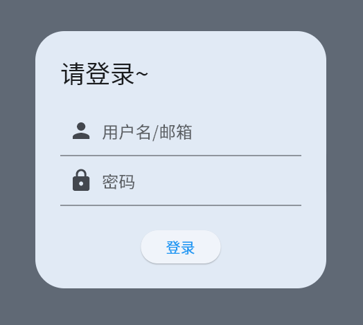
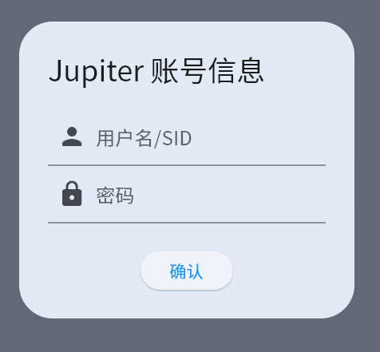
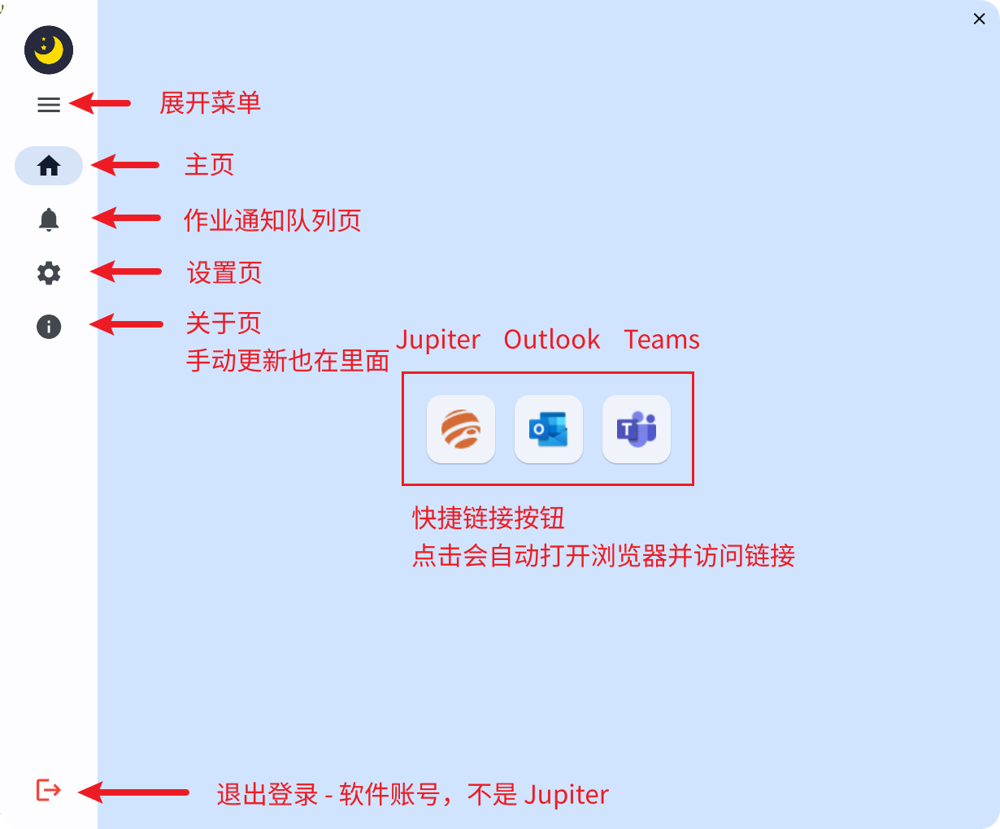
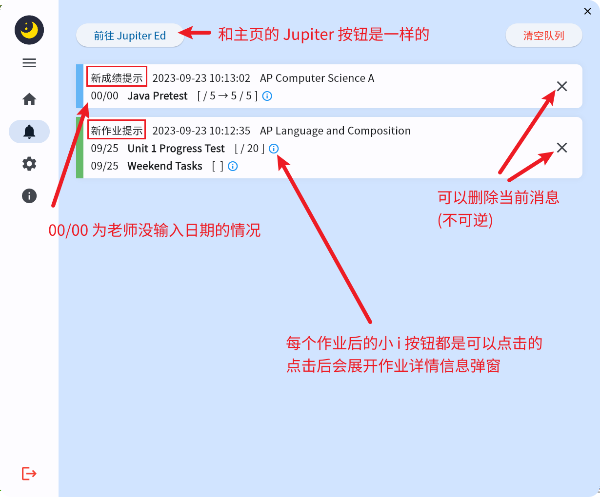
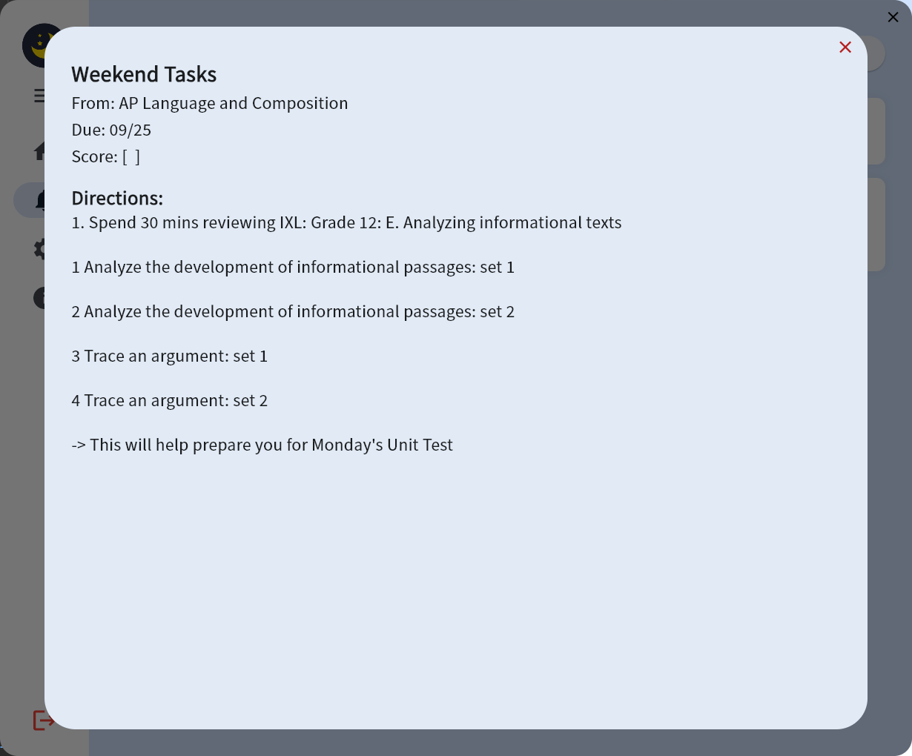

## Scannmay Toolkit  用户手册

- **Language: ** 简体中文

- **Ver. ** 0.0.1

[TOC]

### 初次启动

- 

- 初次启动需要进行登录，此处为软件账号

- **如提示远程服务器离线，请立即联系开发者**

- 
- 之后会询问 Jupiter 账号
- 初次启动软件可能在此处会出现进度条转很久的情况，请耐心等待，是在下载必须的依赖资源
- SID 为学生id 比如说 1279
- **全部完成后就可以正常使用啦~**

- 第一次启动消息队列出现大量新作业为正常情况，可以直接清空队列

### 界面概览

- 

### 作业通知队列页

- 

- 展开详情后界面大概长这样
- 

### 常见问题

#### 为什么第一次登录 Jupiter 账号时按钮进度条一直在转圈？

- **A:** 电脑上可能没有Chromium浏览器，需要自动补齐必要的依赖文件

#### 我的 Jupiter 账号信息会不会被上传至远端服务器？

- **A:** 不会，除了软件的账号登录与退出登录，所有功能都基于本地数据库

#### 怎么关掉软件？

- **A:** 系统托盘，也就是任务栏右下角，右键此软件图标然后点击 `关闭应用` 即可

#### 界面怎么这么难看？

- **A:** 我...我承认我没艺术细胞可以了叭~ 如果觉得有可以提升地方就直接联系我叭
- 有微信直接微信
- QQ 邮箱: 2287990465@qq.com

#### 更新日志在哪？

- **A:** 在更新提示弹框时会显示新版本的更新日志，完整日志可查看 [release.json](https://www.kiriraincat.eu.org/061202/files/scannmay-toolkit/release.json)

#### 发现 bug 或觉得有可以提升的地方？

- **A:** 联系开发者即可
- 如果是 bug 请带上 logs 文件夹的当日日志 `.txt` 文件，并告知 bug 出现的大概时间
- 有微信直接微信
- QQ 邮箱: 2287990465@qq.com